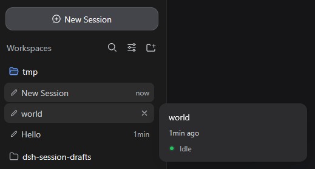
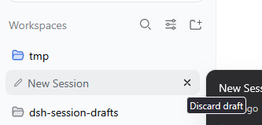

# dsh-session-drafts

[](https://github.com/ne-ilyxa/dsh-session-drafts/actions/workflows/ci.yml)

Cursor-style **New Session** for [DeepSeek Harness](https://github.com/deepseek-ai/deepseek-harness) (DSH): every click mints a **fresh durable blank session** — persisted in Session persistence before the first message is ever sent — so you can keep several empty chats open at once, exactly like Cursor's new-chat tabs.

The stock web shell reuses a workspace's single blank session (one empty chat per workspace, silently). This plugin removes that cap and adds a sidebar **Drafts** switcher to manage the empties.

## What it does

1. **Fresh drafts, never reuse.** `workspaces.startSession` — the one service entry behind every New Session surface (sidebar button, workspace browser, agent preset) — is patched on the live `WorkspaceRuntime` instance to always call `session.create` (which persists the Session entity host-side) and open the result. The stock target policy is preserved: explicit workspace → current session's workspace → recent workspace; no workspace at all still clears into the pure New Session view.
2. **Drafts switcher.** The stock sidebar tree hides blank sessions other than the current one. An add-on `sidebar.footer.action` entry renders a **Drafts (N)** trigger above Settings with a popover that lists every blank draft (workspace label + age, newest first): click to switch, **×** to discard (workspace archive — the row hides, the session log remains), or mint another draft from the panel footer.
3. **Zero core edits.** Instance-level property shadowing guarded by a `Symbol.for` marker (idempotent across HMR), restored on plugin unload, falling back to the stock method on any synchronous failure. No harness files are modified.

## Install

```bash
dsh plugin --profile web add link:/path/to/dsh-session-drafts
# or from a published copy:
dsh plugin --profile web add @ne-ilyxa/dsh-session-drafts
```

Then restart the DSH web host (a profile boot composes the client bundle into the boot graph; hot activation is not attempted by this plugin).

### Release channels

- **npm** — `@ne-ilyxa/dsh-session-drafts`; published from CI via [trusted publishing (OIDC)](https://docs.npmjs.com/publishing-packages/publishing-with-trusted-publishing): no stored tokens, no 2FA prompts. Pushing a `v*` tag runs [release.yml](.github/workflows/release.yml): tests → prebuilt tarball attached to the GitHub Release → `npm publish --provenance`. The one-time setup is on npmjs.com: Account Settings → Publishing access → Add trusted publisher (repository `ne-ilyxa/dsh-session-drafts`, workflow `release.yml`, environment `release`).
- **Prebuilt tarball** — every GitHub Release carries `dsh-session-drafts.tgz` (built by `prepack`, installable without npm and without pnpm's `allowBuilds` build approval).

## Keyboard shortcuts

| Shortcut | Action |
|---|---|
| `Ctrl+Alt+N` | Mint a fresh draft from anywhere (works with zero drafts too) |
| `Ctrl+Alt+D` | Open / close the Drafts popover |

## Verify it works

1. Click **New Session** twice — two empty chats now coexist (watch the Drafts count go up; no reuse jump).
2. Open **Drafts** in the sidebar foot, switch between the empties, discard one with **×**.
3. Host truth: each click produced a `session.create` — sessions survive a page refresh and the host restart.

## Screenshots

Three New Session clicks on one workspace — three independent durable drafts (plus the initial one), no reuse:



Switching between drafts — the accent bar marks the current one:



## Development

```bash
pnpm install
pnpm run check     # typecheck + build + node --test tests/*.test.mjs
pnpm run build     # host no-op + browser bundle (lib/client.js, module-loader wrapped)
pnpm test:e2e      # full UI flow on an isolated DSH host (needs a harness checkout + Chrome)
```

The E2E smoke boots a throwaway DSH web host (its own `DSH_HOME` scratch profile with this checkout installed), drives the real UI in headless Chrome, and asserts host-side session truth. It skips with exit 0 when the environment is missing — configure via `E2E_DSH_ROOT` (harness checkout, default `/home/ilya/deepseek-harness`) and `CHROME_PATH` (default `/usr/bin/google-chrome`).

Layout:

- `src/index.ts` — host half, a deliberate no-op (the package must be a loadable Profile Bundle; all behavior is browser-side).
- `src/client/index.tsx` — browser half: the `startSession` patch, pure draft derivation (`selectDraftRows`, `draftAge`), the Drafts widget, zh/en dictionaries.
- `tests/` — pure-logic tests over the built bundle (VM-loaded with mocked externals) + package-layout guards.

## Compatibility

- DSH client runtime `0.1.0-rc.8`-era slot/service names (`sidebar.footer.action`, `workspaces.startSession`, `sessions.create`, `workspaces.archiveSession`).
- The patch degrades loudly-but-safely: if the runtime shape ever drifts, a console warning fires and New Session stays stock.

## License

BSD-3-Clause © ne-ilyxa
