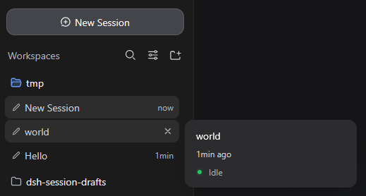
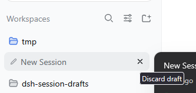

# dsh-session-drafts

[](https://github.com/ne-ilyxa/dsh-session-drafts/actions/workflows/ci.yml)

Cursor-style **draft chats** for [DeepSeek Harness](https://github.com/deepseek-ai/deepseek-harness) (DSH): New Session **reuses the empty draft** — and only mints a fresh one when every draft has unsent text — so empty placeholders never stack, exactly like Cursor's (or Telegram's) chat list. Every draft lives in the sidebar tree **as an ordinary row**: unsent-text preview title, creation time, a pencil mark and a gray tint, persistent across page reloads and host restarts. No popup, no drafts menu.

The stock web shell reuses a workspace's single blank session regardless of typed text (one empty chat per workspace, silently discarding your draft), and hides every other blank from the tree. This plugin replaces both behaviors.

## What it does

1. **Never stack empty drafts — on every mint path.** Since the harness `0.2` refactor the mint flow lives on the `uiWorkspace` navigation service, and `uiWorkspace.connectWorkspace` is the funnel every New Session surface goes through (the sidebar button, the folder ＋, `Ctrl+Alt+N`, the hero workspace picker, the boot initial selection) — so that is the seat the rule patches. Connect first **jumps to the workspace's existing EMPTY draft** (a session the host says has no sent turn and whose composer carries no unsent text) and only **mints a fresh durable session** (`session.create`) when every draft is occupied. The stock method is replaced — not wrapped — because its blank-reuse scan reuses the workspace's blank regardless of typed text (one empty chat per workspace, silently discarding the draft you were writing). The per-workspace in-flight dedupe survives in the patch (a rapid double-click collapses into ONE connect), a never-engaged placeholder is adopted through the stock create handshake, and a `session/writer-held` refusal falls through to the fresh mint. Typed drafts stay put as their own chats; empty placeholders never multiply.
2. **Drafts as tree rows.** The stock tree hides blank sessions other than the current one, so the plugin overlays the **data**: `sessions.list.getSnapshot` is shadowed on the live store object (identity-stable, HMR-safe) to project every draft with `blank: false` and a draft title. The stock tree then renders each draft as a first-class row under its workspace — creation time in the trailing cell, click to open. "Draft" follows the host's own truth (`sessionListMetadata.blank` — the folded prefix contains no turn), which survives the `0.2` semantic change where opening a session flips the client `blank` bit: an opened-but-never-prompted draft keeps its row, its preview and its ×. The first sent message ends the draft state and the row becomes an ordinary chat, untouched by the overlay. The projection is idempotent over its own output (rows it produced are branded), so a re-captured snapshot face can never freeze a title.
3. **One affordance: ×.** A draft is a placeholder, not a chat — every stock row control (the ⋯ menu, the row-level archive/pin buttons) is muted, and the only trailing control is a **×** in the same hover cell: hidden until the row is hovered, gray, 16px, and one click discards the draft (workspace archive — the row disappears, the session log remains; the main selection clears when it was the open draft). After the first sent message the row graduates into an ordinary chat and its stock controls return.
4. **Live preview titles.** A draft's row title is its unsent composer text (Telegram-style, whitespace-collapsed, 60 chars), read live through `conversation.input` and mirrored to `localStorage` so previews survive reloads; an empty composer shows the localized *New Session*. The title is written to both summary faces the tree consumes — `title` (the renderer's row label) and `displayTitle` (archive-confirm and hover-copy) — and overlay-only changes wake the store's raw subscribers, so the tree retitles on every keystroke.
5. **Visual draft identity.** Draft rows get a gray title (theme-aware design token — gray-next-to-white in dark, muted-next-to-black in light) and a pencil icon in the row's empty status slot, painted by a MutationObserver marker. Rows are identified by the explicit `data-row-key="session:<id>"` attribute the `0.2` renderer stamps, with the React-fiber walk as the fallback — never by text, which can collide with a graduated chat's title. The gray tint targets the title span itself (the stock row CSS carries an explicit title color since `0.2`). Purely cosmetic and self-healing: if the DOM shape drifts, the rows keep working and only lose the tint.
6. **Zero core edits.** Instance-level property shadowing guarded by `Symbol.for` markers (idempotent across HMR), restored on plugin unload, falling back to the stock behavior on any synchronous failure. No harness files are modified — install the plugin and it works.

## Install

```bash
dsh plugin --profile web add link:/path/to/dsh-session-drafts
# or from a published copy:
dsh plugin --profile web add @ne-ilyxa/dsh-session-drafts
```

Then restart the DSH web host (a profile boot composes the client bundle into the boot graph; hot activation is not attempted by this plugin).

### Release channels

- **npm** — `@ne-ilyxa/dsh-session-drafts`; published **manually** by the maintainer (`npm login && npm publish --access public` — `prepack` builds the package). CI never touches the registry.
- **Prebuilt tarball** — pushing a `v*` tag runs [release.yml](.github/workflows/release.yml): checks → `pnpm pack` → `dsh-session-drafts.tgz` attached to the GitHub Release. Installable without npm and without pnpm's `allowBuilds` build approval; this is the artifact storefronts prefer.

## Keyboard shortcuts

| Shortcut | Action |
|---|---|
| `Ctrl+Alt+N` | New Session from anywhere — same rule as the button: jump to the empty draft, mint only when all are occupied (layout-independent — matches the physical KeyN, Russian layouts included) |

(The v0.1 `Ctrl+Alt+D` popover toggle died with the popover.)

## Verify it works

1. With an empty draft under the workspace, click **New Session** — you land on that empty draft; nothing new is created (empty placeholders never stack).
2. Type something in it and click **New Session** again — now a fresh draft is minted and selected; the typed one stays in the tree, retitled to your unsent text. Refresh the page — everything is still there.
3. Hover a draft row — a gray **×** appears where other rows have **⋯**; click it to discard the draft. Send a message in one and it graduates into an ordinary chat row (⋯ menu back).
4. Host truth: a mint happens only when it should — sessions survive a page refresh and the host restart.

## Screenshots

The plugin in the DSH web UI — drafts living in the sidebar tree:





## Development

```bash
pnpm install
pnpm run check     # typecheck + build + node --test tests/*.test.mjs
pnpm run build     # host no-op + browser bundle (lib/client.js, module-loader wrapped)
pnpm test:e2e      # full UI flow on an isolated DSH host (needs a harness checkout + Chrome)
node scripts/capture-screens.mjs   # re-shoot assets/drafts-*.png against a live isolated host
```

The E2E smoke boots a throwaway DSH web host (its own `DSH_HOME` scratch profile with this checkout installed), drives the real UI in headless Chrome, and asserts host-side session truth plus the tree DOM. It skips with exit 0 when the environment is missing — configure via `E2E_DSH_ROOT` (harness checkout, default `/home/ilya/deepseek-harness`) and `CHROME_PATH` (default `/usr/bin/google-chrome`).

Layout:

- `src/index.ts` — host half, a deliberate no-op (the package must be a loadable Profile Bundle; all behavior is browser-side).
- `src/client/index.tsx` — browser half: the `uiWorkspace.connectWorkspace` patch (the empty-draft reuse rule on every mint path), the `sessions.list` draft projection (`projectDraftList`), the live preview mirror, the DOM row marker, the hotkey, zh/en dictionaries. No React, no slots — the stock tree renders the drafts.
- `tests/` — pure-logic tests over the built bundle (VM-loaded) + package-layout guards; `tests/e2e/` — the isolated-host UI smoke.

## Compatibility

Which harness versions each plugin line was verified against:

| Plugin | DSH harness | Status |
|---|---|---|
| **0.7.x** | **`0.2.0-rc.2`** | **Current.** Verified end-to-end (unit + full UI smoke on an isolated host): the `uiWorkspace` mint flow, `sessionListMetadata` draft truth (the `0.2` engaged-session `blank` semantics), `title`/`displayTitle` row labels, `data-row-key` row identity, muted row archive/pin buttons, token-gated web surface. |
| 0.6.x and older | `0.1.x` (rc.8-era service shapes: `workspaces.startSession`, dotted RPC names, textarea composer) | Historical. On a `0.2`+ harness these versions degrade: rows label every draft *Untitled*, previews freeze, and New Session stops reusing empty drafts — upgrade to 0.7. |

The patches still degrade loudly-but-safely: if the runtime shape ever drifts again, a console warning fires and the corresponding piece stays stock.

## License

BSD-3-Clause © ne-ilyxa
